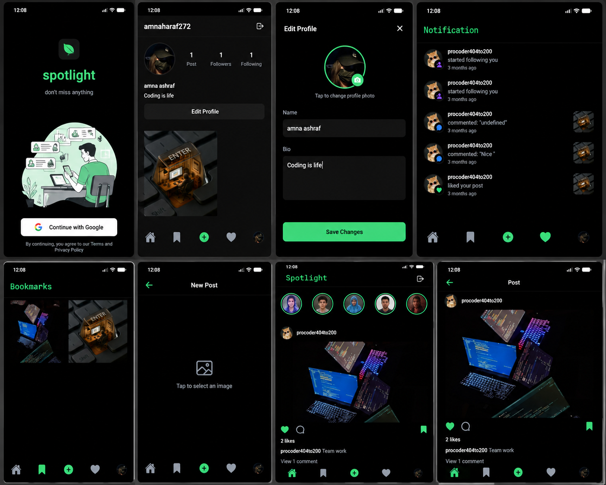

# 📱 Social Media App

A real-time social media mobile application built with **React Native, Expo, Clerk, and Convex**. Users can share posts, interact with other users, manage profiles, and receive real-time notifications.

## ✨ Features

- 🔐 **Authentication** — Secure sign up, login, logout, and Google authentication with Clerk.
- 🏠 **Home Feed** — Browse posts from the community in real time.
- ❤️ **Likes & Comments** — Interact with posts through likes and comments.
- 🔖 **Bookmarks** — Save posts for later.
- 👥 **Follow System** — Follow and connect with other users.
- 🔔 **Notifications** — Receive notifications for likes, comments, and follows.
- ➕ **Create Posts** — Create posts and upload images directly from your device.
- 🖼️ **Image Uploads** — Select and upload images from the device.
- 👤 **Profile** — View and manage your profile and published posts.
- ✏️ **Profile Editing** — Update profile information with an animated editing interface.
- 📱 **Cross-Platform** — Built to run on Android, iOS, and Web.
- ⚡ **Real-Time Updates** — Real-time data synchronization powered by Convex.
- 🚀 **Performance** — Optimized rendering and efficient list handling.
- 🎨 **Custom UI** — Custom fonts, icons, styling, animations, and reusable components.

## 📸 Screenshots

<p align="center">
  
</p>

## 🛠️ Tech Stack

- **React Native** — Mobile application
- **Expo** — Cross-platform development
- **Expo Router** — File-based navigation
- **Clerk** — Authentication and user sessions
- **Convex** — Real-time backend and database
- **JavaScript / TypeScript** — Application development
- **Expo Image Picker** — Device image selection
- **React Navigation** — Navigation system
- **Svix** — Webhook integration

## 📦 Version

- **Expo:** SDK 54
- **React Native:** 0.81.5
- **React:** 19.1.0
- **Expo Router:** 6.0.23
- **Clerk Expo:** 2.19.31
- **Convex:** 1.36.1
- **TypeScript:** 5.9.2

## 📁 `.env` Setup

Create a `.env` file in the project root:

```env
CONVEX_DEPLOYMENT=dev:your_deployment_name

EXPO_PUBLIC_CONVEX_URL=https://your-deployment.convex.cloud

EXPO_PUBLIC_CONVEX_SITE_URL=https://your-deployment.convex.site

EXPO_PUBLIC_CLERK_PUBLISHABLE_KEY=pk_test_your_publishable_key
```

## 📱 Run the App

```bash
npm install
npx expo start
```

Then run the application on your preferred platform using Expo.